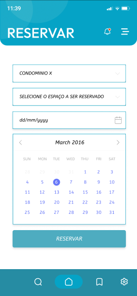

# Projeto de Interface

Visão geral da interação do usuário pelas telas do sistema e protótipo interativo das telas com as funcionalidades que fazem parte do sistema (wireframes). Nesta seção serão apresentados as principais interfaces da plataforma. 

## Diagrama de Fluxo

O diagrama de fluxo apresentado abaixo ilustra a interação entre os usuários, os condomínios e o sistema de reservas de espaços. O sistema permite que os usuários criem contas, façam login e realizem reservas em espaços dentro dos condomínios. Os condomínios, por sua vez, podem aprovar ou cancelar as reservas feitas pelos usuários. A API é responsável por autenticar os usuários e gerenciar as reservas. O frontend web e mobile fornecem interfaces para os usuários e condomínios interagirem com o sistema. O diagrama de fluxo ajuda a planejar e a entender a lógica de interação entre os usuários, os condomínios e o sistema, garantindo uma experiência de usuário mais intuitiva e eficiente.

## Wireframes

Os wireframes são protótipos utilizados em design de interface para sugerir a estrutura de um site web e seus relacionamentos entre suas páginas. Eles permitem uma visão geral da estrutura e do layout da aplicação, ajudando a identificar problemas de usabilidade e fluxo de navegação antes de investir em desenvolvimento.

A seguir, apresentamos os wireframes da nossa aplicação para reserva de espaços em condomínios, tanto para a versão web quanto para a versão mobile. Esses protótipos visam demonstrar a estrutura e o layout das diferentes páginas da aplicação, além de ilustrar a navegação e a interação entre as telas.

### Web Client

### Mobile Client

