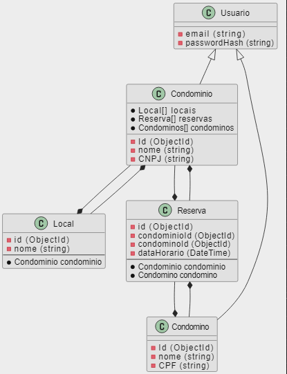
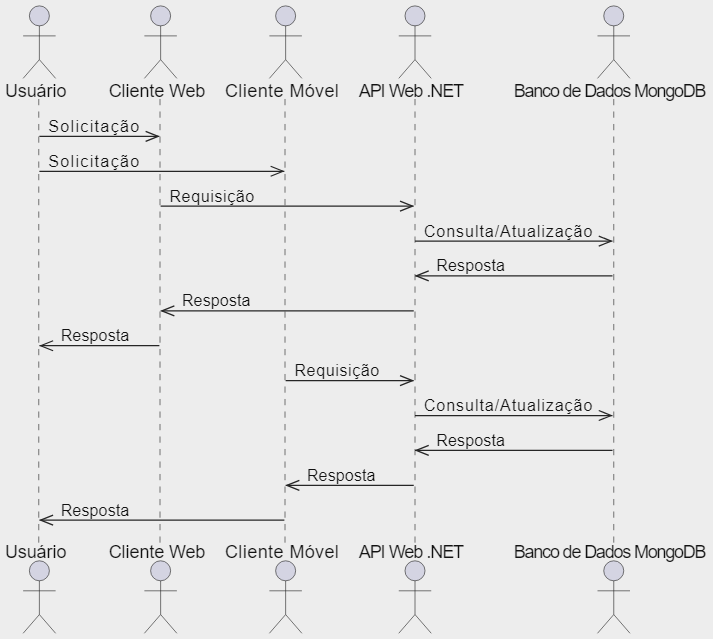

# Arquitetura da Solução

Pré-requisitos: <a href="3-Projeto de Interface.md"> Projeto de Interface</a>

Definição de como o software é estruturado em termos dos componentes que fazem parte da solução e do ambiente de hospedagem da aplicação.

## Diagrama de Classes

O diagrama de classes ilustra graficamente como será a estrutura do software, e como cada uma das classes da sua estrutura estarão interligadas. Essas classes servem de modelo para materializar os objetos que executarão na memória.

O diagrama de classes a seguir, adaptado para um ambiente de banco de dados NoSQL - onde a estrutura dos dados pode ser mais flexível e não segue necessariamente um esquema rígido como em bancos de dados SQL, apresenta a estrutura das entidades principais do sistema, incluindo Condomínio, Condomino, Reserva e Local.

1. Condomínio: Esta classe representa um condomínio e seus atributos básicos como Id (identificador único) e Nome. Além disso, possui coleções de Condominos, Locais e Reservas. Essas coleções podem ser consideradas como referências a documentos relacionados em um banco de dados NoSQL, onde não há uma estrutura de tabela fixa. Por exemplo, um condomínio pode ter uma lista de IDs de Condominos que pertencem a ele, uma lista de IDs de Locais disponíveis e uma lista de IDs de Reservas feitas neste condomínio.

2. Condomino: Esta classe representa um condômino e seus atributos básicos como Id e Nome. Da mesma forma que Condomínio, possui coleções de Condomínios (indicando os condomínios aos quais o condômino pertence) e Reservas (indicando as reservas feitas pelo condômino).

3. Reserva: Esta classe representa uma reserva de espaço em um condomínio. Ela possui atributos como Id, Data de Início e Data de Fim, e também faz referência ao condomínio onde a reserva foi feita, o condômino que fez a reserva e o local reservado. 

4. Local: Esta classe representa um espaço público dentro de um condomínio, como uma área de lazer. Possui atributos como Id e Descrição, que fornecem informações sobre o local.  

## Modelo ER

O modelo Entidade-Relacionamento (ER) proposto descreve a estrutura de um banco de dados NoSQL baseado em documentos, composto por quatro entidades principais: Condominio, Condomino, Local e Reserva. A entidade Condominio representa um condomínio ou complexo residencial, identificado por um atributo único, id, e possui um nome. Além disso, um Condominio pode possuir vários Condominos, Locais e Reservas.

A entidade Condomino representa um morador ou residente do condomínio, identificado por um atributo único, id, e possuindo um nome. Um Condomino pode estar associado a um ou mais Condominios, indicando os condomínios onde ele reside. Adicionalmente, um Condomino pode realizar várias Reservas de locais dentro do condomínio.

A entidade Local representa um espaço ou instalação dentro do condomínio que pode ser reservado, identificado por um atributo único, id, e possuindo um nome. Um Local pode ser parte de um ou mais Condominios e pode ser reservado em diferentes datas e horários por meio das Reservas. No modelo proposto, Local é uma subcoleção aninhada da coleçao Condominio.

A entidade Reserva representa a reserva de um Local por um Condomino em um determinado momento, identificada por um atributo único, idreserva. Uma Reserva está associada a um Condomino, indicando quem fez a reserva, a um Local, indicando o local reservado, e a uma data e hora específicas. Um Condomino pode ter zero ou mais Reservas de locais dentro do condomínio. No modelo proposto, Reserva é uma subcoleção aninhada das coleções Condominio e Condominos.

## Esquema Relacional

O esquema relacional apresentado abaixo representa a estrutura de dados da aplicação de reserva de espaços em condomínios. Foi projetado para armazenar e relacionar as informações de condomínios, condominos, locais, reservas e usuários.

## Modelo Físico

Ao final do trabalho será entregue um arquivo banco.sql contendo os scripts de criação das tabelas do banco de dados. Este arquivo será incluído dentro da pasta src\bd.

## Tecnologias Utilizadas

As tecnologias utilizadas para resolver o problema de reserva de espaços em condomínios incluem Next.js para o frontend web, React Native para o cliente móvel, uma API Web .NET como middleware e um banco de dados MongoDB como repositório de dados. Cada uma dessas tecnologias foi escolhida por suas características e benefícios específicos.

Next.js é um framework de desenvolvimento web baseado em React, que possibilita a criação criar aplicativos web rápidos, seguros e escaláveis. Já o React Native é uma biblioteca de desenvolvimento de aplicativos móveis que nos permite criar aplicativos móveis de alta qualidade para Android e iOS, utilizando linguagem e ferramentas similarityaos ao React.

A nossa API Web .NET é responsável por receber e processar as solicitações do cliente, seja ele web ou móvel, e se comunicar com o banco de dados para recuperar ou armazenar informações. Isso permite uma separação clara entre a lógica de negócios e a camada de apresentação, tornando a manutenção e atualização da aplicação mais fácil.

Por fim, o MongoDB é um banco de dados Não Relacional (NoSQL) que nos permite armazenar e recuperar grandes quantidades de dados de forma escalável e eficiente. Isso é especialmente importante em nosso caso, pois precisamos lidar com uma grande quantidade de reservas e informações de usuário.

A figura abaixo ilustra como as tecnologias estão relacionadas e como uma interação do usuário com o sistema é conduzida. O usuário faz uma solicitação através do cliente móvel ou web, que é enviada para a API Web .NET. A API então se comunica com o banco de dados MongoDB para recuperar ou armazenar informações. Em seguida, a API retorna a resposta ao cliente, que é apresentada ao usuário.

## Hospedagem

Explique como a hospedagem e o lançamento da plataforma foi feita.

> **Links Úteis**:
>
> - [Website com GitHub Pages](https://pages.github.com/)
> - [Programação colaborativa com Repl.it](https://repl.it/)
> - [Getting Started with Heroku](https://devcenter.heroku.com/start)
> - [Publicando Seu Site No Heroku](http://pythonclub.com.br/publicando-seu-hello-world-no-heroku.html)

## Qualidade de Software

Conceituar qualidade de fato é uma tarefa complexa, mas ela pode ser vista como um método gerencial que através de procedimentos disseminados por toda a organização, busca garantir um produto final que satisfaça às expectativas dos stakeholders.

No contexto de desenvolvimento de software, qualidade pode ser entendida como um conjunto de características a serem satisfeitas, de modo que o produto de software atenda às necessidades de seus usuários. Entretanto, tal nível de satisfação nem sempre é alcançado de forma espontânea, devendo ser continuamente construído. Assim, a qualidade do produto depende fortemente do seu respectivo processo de desenvolvimento.

A norma internacional ISO/IEC 25010, que é uma atualização da ISO/IEC 9126, define oito características e 30 subcaracterísticas de qualidade para produtos de software.
Com base nessas características e nas respectivas sub-características, identifique as sub-características que sua equipe utilizará como base para nortear o desenvolvimento do projeto de software considerando-se alguns aspectos simples de qualidade. Justifique as subcaracterísticas escolhidas pelo time e elenque as métricas que permitirão a equipe avaliar os objetos de interesse.

> **Links Úteis**:
>
> - [ISO/IEC 25010:2011 - Systems and software engineering — Systems and software Quality Requirements and Evaluation (SQuaRE) — System and software quality models](https://www.iso.org/standard/35733.html/)
> - [Análise sobre a ISO 9126 – NBR 13596](https://www.tiespecialistas.com.br/analise-sobre-iso-9126-nbr-13596/)
> - [Qualidade de Software - Engenharia de Software 29](https://www.devmedia.com.br/qualidade-de-software-engenharia-de-software-29/18209/)
